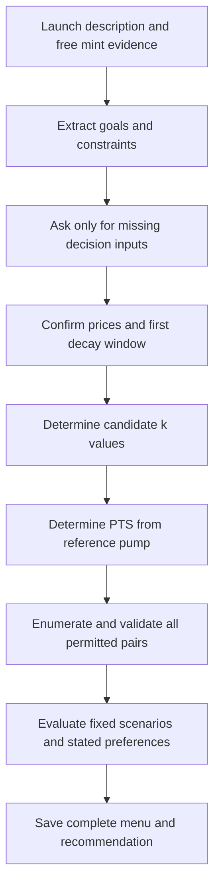

# Pulse Pricing Calibration Protocol

**PPCP v1** is the repeatable decision procedure for choosing paid Pulse mint parameters from a launch brief and free-mint evidence. It produces every configuration permitted by a declared finite policy, an evaluation of each, and one recommendation with explicit tradeoffs. Use it when planning the 1,024-slot free phase, during evidence collection, and before fixing paid economics.

This component contains the procedure, an [intake template](intake.template.md), a [decision report template](decision-report.template.md), and the [current reference options](reference-options.md). It is a planning component. Its reference recommendation is provisional; it does not set deployed prices or authorize launch.

## Resume the protocol

When returning to pricing, use this instruction with the current evidence:

> Run PPCP v1 from docs/pulse-pricing-protocol/README.md. Read my description and the saved intake. Ask only for missing decision inputs, keep unknowns explicit, enumerate every configuration inside the declared policy, evaluate each using the pinned Pulse math, and save a decision report. Do not silently change the price band or policy bounds.

Create a dated run when free-mint planning or observations begin:

```sh
pricing_run_dir="docs/pulse-pricing-protocol/runs/$(date -u +%Y%m%dT%H%M%SZ)"
mkdir -p "$pricing_run_dir"
cp docs/pulse-pricing-protocol/intake.template.md "$pricing_run_dir/intake.md"
cp docs/pulse-pricing-protocol/decision-report.template.md "$pricing_run_dir/decision-report.md"
```

Record aggregate observations and evidence references in the intake. Replace template placeholders when writing the report. Keep each completed run so later decisions can be compared with the observations available at the time.

## Deployment timing

Choose the application route before opening the free phase. In current [RC2](../../contracts/src/release/SignaturesPulseMintV1RC2.sol), all four paid parameters are immutable constructor inputs. Exhausting the free quota starts paid pricing immediately; the deadline starts it even while paused. Pausing stops mint transactions, not the deadline or price clock. Admin changes to free eligibility, capacity or quota do not change paid economics.

Therefore, a recommendation based on observations from that same collection's free phase cannot be applied to an already deployed RC2 collection. The available routes are:

- Collect pilot evidence before deploying the collection whose paid prices will use it.
- For a future release, separately design a pending paid phase and one-time price finalization after free-mint review. That mechanism is not implemented by PPCP.
- If using RC2 unchanged, select economics before deployment; later PPCP runs evaluate those economics and inform a future collection or release.

The current RC2 and core lock support Anvil and Sepolia only. A mainnet launch requires its own release work. Report applicability separately from whether a parameter pair is numerically valid.

## Procedure



### Step 1 Record the brief and evidence

Use the intake template or extract equivalent fields from the user's description. Retain the original wording and distinguish observations, hypotheses, preferences and hard constraints. Words such as "must" and "at most" establish hard limits; "roughly" and "prefer" do not establish an exact tolerance.

Collect free claims over a stated time window, the effective quota and eligibility revision, successful mints, distinct wallets, concentration, traffic sources where known, return activity, and the preparation-to-mint funnel where measured. Separate failed preparation, wallet abandonment and transaction failures from lack of demand. Slots are entitlements, not people: one wallet can hold several, and several wallets can belong to one person.

Free uptake measures participation under free-price eligibility and gas friction. It does not identify paid conversion, demand elasticity or willingness to pay. Do not turn a fast free sellout into an automatic price increase. Treat price-specific paid interest as separate evidence and distinguish stated interest from executed paid purchases.

Record provider costs, gas and any other buyer fees with dates and sources where available. Unknown cost stays unknown; do not claim profitability or a total buyer spending ceiling has been verified when its components are missing. Refresh any market research used for a live decision rather than treating historical NFT mint prices as current comparables.

### Step 2 Establish whether the intake is sufficient

There is no universal number of free mints or sellout speed that makes the intake sufficient. The run must identify its observation window, eligibility and access conditions, measured outcomes, known friction, launch objective, price band, and deployment route. Explain why the evidence supports the intended decision and what remains uncertain.

Timing or pump preferences can remain unknown: compare the menu without inventing them. Unknown paid demand makes a recommendation provisional, rather than preventing numerical evaluation. Do not call a report ready to apply if the contract cannot accept the proposed settings, necessary numerical checks are stale, or stated hard constraints remain unresolved.

Use four report states: **needs intake**, **provisional recommendation**, **ready for decision**, and **decision recorded**. A decision recorded in the report is distinct from deployment, activation or an on-chain configuration change.

### Step 3 Confirm the price band and policy

The current band is an initial ask of **0.01 ETH** and initial floor of **0.001 ETH**. These reflect the desired price positioning; they are not inferred automatically from free participation. If observations justify another band, state that change explicitly and enumerate a new menu. Do not carry over the ten-option count to another band.

PPCP uses integer powers of ten for raw `k` and `PTS`, as requested by the project owner. This is a selection rule, not a Pulse contract requirement. Market-facing derived prices and times need not be powers of ten.

The proposed v1 operating envelope is:

| Rule | Value |
| --- | --- |
| Initial ask anchor | 0.01 ETH |
| Initial floor | 0.001 ETH |
| Maximum actual opening error above the anchor | 1% |
| First quiet-period target before any paid mint | Quote at or below 0.005 ETH |
| Maximum time to that target | 100,000 seconds |
| Reference cycle duration for pump comparison | 100,000 seconds |
| Maximum actual added premium at that reference duration | 0.01 ETH |
| Candidate coefficients | Exact integer powers of ten |

These bounds are proposed product and engineering policy, not experimentally established market optima. Keep their proposal or acceptance status in each report. Changing a bound requires a declared policy revision and a fresh enumeration; it must not happen silently to obtain a preferred result.

100,000 seconds is about 27.8 hours, not one day. The reference premium limit applies at that duration; it is not a cap for every possible quiet period.

### Step 4 Determine k from opening decay

Ask only if missing: **Before the first paid mint, when should the quote reach the desired lower price?** Accept a target price and time, or a percentage drop and time. Distinguish the percentage of the entire ask from the percentage of the premium above the floor.

The order is **ask and floor → first decay window → k → reference pump → PTS**. PTS has no effect on the opening curve. For the current band, the half-ask benchmark is 0.005 ETH; it is a comparison convention, not a research-backed ideal discount.

Map the desired opening behavior to each permitted power-of-ten `k` using exact integer math. Keep adjacent permitted choices visible and report their actual timing rather than inventing an intermediate coefficient. A target below the current floor is unattainable.

### Step 5 Determine PTS from pump tolerance

Ask only if missing: **After the reference quiet period, how large should the added premium be, and is that a preference or a hard limit?** Express it in ETH or as a percentage of an explicit reference price. Avoid an ambiguous percentage of "the price".

At the reference duration, compare every permitted PTS for the candidate k values. The continuous target premium is `D = PTS × max(T, 1 second)`; the actual integer quote can differ because the anchor offset is rounded. At fixed k, a larger PTS makes a larger premium and a shorter first premium half-time at the same T. It does not imply the premium is smaller at a fixed later elapsed time.

Use the longest plausible idle period supplied by the intake as an additional scenario. If it is unknown, retain the standardized 90-day case; do not mistake it for a forecast.

### Step 6 Enumerate and evaluate all options

Enumerate every power-of-ten pair allowed by the Solidity types, exact validation and declared envelope. Do not start from an arbitrary nine-cell grid or prune choices to make the output shorter. At the reference timestamp and current band, exactly ten options pass; see the reference snapshot.

Apply contract checks before interpreting market fit: positive k and PTS, valid genesis gap, PTS within uint128, anchor offsets within the allowed domains, strict start-time checks, and checked uint256 arithmetic. Match RC2's initialize plus immediate advance checks at both deployment time and the free deadline. Recompute for the actual release, chain and dates; a saved snapshot is not a deployment preflight.

For every option, report:

- Actual opening quote and rounding error; time to the opening target.
- Actual pump and first premium half-time at the fixed reference duration.
- The first and 100th paid prices, resulting floors and quote ten minutes after the last sale, for hourly and daily mint sequences beginning at opening.
- A first sale after 90 idle days, its immediate following quote, and that quote ten minutes later without another sale.
- A burst at the chain's permitted paid-mint cadence, using stated assumptions. Current RC2 allows one successful paid mint per collection per block. Use the actual target-chain timestamps or explicitly labeled synthetic intervals, not a universal assumed block time.
- Any additional intake scenario, hard-constraint violation, unknown cost or deployment applicability issue.

Scenarios are stress tests, not demand or revenue forecasts. Compare the same assumptions for all options. Preserve all rows, including rejected ones, with the reason for rejection. If no option meets the constraints, show the conflict instead of changing them.

### Step 7 Recommend and record the decision

Rank admissible options using the user's declared priority order. Explain concrete tradeoffs such as opening speed, pump magnitude, persistence and ratcheted floor growth. Do not use an unexplained weighted score, label a coefficient market optimal, or treat a reference pump ceiling as a target.

If priorities remain unknown, return the comparison and at most a conditional recommendation. The current provisional choice is **E: k = 10^18, PTS = 10^9**, conditional on wanting the quote to reach 0.005 ETH in a few minutes and about 0.0001 ETH of added premium after 100,000 seconds. Those preferences have not been established as hard limits.

Save the complete menu, evaluation assumptions, source and policy versions, evidence gaps, recommendation, alternative and sacrifice in the decision report. Record the owner's decision only when actually supplied. Re-run if the price band, policy, evidence, launch dates, release or owner priorities change.

## Pulse math to preserve

The source of truth is [PulseMath.sol](../../contracts/vendor/pulse-core-v1.0.0/src/core/PulseMath.sol), pinned by [consumer-lock.json](../../contracts/vendor/pulse-core-v1.0.0/consumer-lock.json) to tag `pulse-core-v1.0.0`, commit `a08ec26e396b9d3e20ccebd8871f176368bcd713`.

Use wei and integer seconds throughout calculations. `k` has units wei·seconds; PTS has units wei/second. Do not use floating-point ETH arithmetic for validation or quote calculations.

For initial ask A and floor F, the opening anchor distance is `h0 = floor(k / (A - F))`. The actual opening quote is `F + floor(k / h0)`. For a target Q strictly above F, the first integer second at or below it is:

```text
t = max(0, floor(k / (Q - F + 1 wei)) + 1 - h0)
```

Every paid sale ratchets the floor to its paid ask S, including the first. For duration T since the previous curve start, `D = PTS × max(T, 1 second)` and `h = floor(k / D)`. The immediate next premium is `floor(k / h)` when h is positive; when h is zero, the core returns k at that timestamp. Subsequent quotes use the exact core division by elapsed seconds from the new anchor.

The continuous approximation after a sale is `ask(u) = S + D / (1 + uD/k)`. Its first premium half-time is `H = k/D`, so **D × H = k**. D and H need not equal those of other cycles. Within one cycle, successive premium-halving intervals are H, 2H, 4H and so on; Pulse is not exponential decay with a fixed half-life. Exact integer results can differ from this approximation.

The initial floor is not a permanent discount destination. After a paid sale, the quote decays toward that new floor. Later executed paid prices cannot undercut earlier executed paid prices along the same canonical history. There is no finite positive time at which the continuous premium reaches zero; integer rounding may eventually remove it.

## Research basis and limits

[Art Blocks](https://docs.artblocks.io/creator-onboarding/artists/minters/) provides an interface precedent for showing start price, base price and decay timing. Its exponential auctions and settlement variants are different mechanisms. [Paradigm's VRGDA](https://www.paradigm.xyz/writing/vrgda) makes cadence and desired price behavior explicit; it does not establish Pulse coefficients. [Manifold's cost model](https://docs.manifold.xyz/client-sdk/reference/cost.md) separates purchase price and fees, while [prepared purchases](https://docs.manifold.xyz/client-sdk/reference/preparedpurchase.md) expose gas estimates separately.

The [zero-price study](https://people.duke.edu/~dandan/webfiles/PapersPI/Zero%20as%20a%20Special%20Price.pdf) supports treating free demand as a distinct condition. It does not supply a conversion rate for this collection. These sources inform what to ask and display; they establish neither an optimal Pulse configuration nor the power-of-ten policy. Research was gathered for the October 3, 2026 discussion and must be checked again when used for a live market decision.
